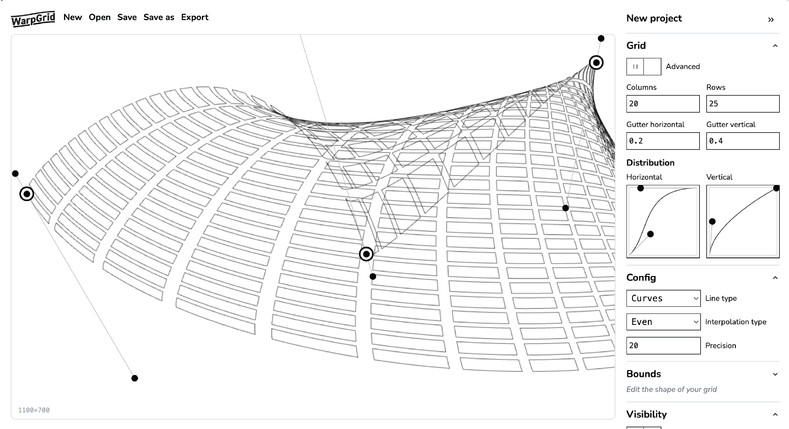

<h1 align="center">
  Warp Grid Editor
</h1>

This is package provides an editor for [warp-grid](https://github.com/undistraction/warp-grid).

You can use it at [warp-grid-editor.undistraction.com](https://warp-grid-editor.undistraction.com).

Projects can be saved-to and loaded-from your browser's local storage.

You can export config for `warp-grid` or export the grid as an SVG.

## Maintenance

### Install

```
pnpm install
```

### Run in development

```
pnpm run dev
```

### Build package

```
pnpm run build
```

### Preview build

```
pnpm run preview
```

### Lint

```
pnpm run lint-prettier
pnpm run lint-eslint
```

### Run tests

#### Unit tests (Vitest)

```
pnpm run test-unit
pnpm run test-unit-watch # Run tests and watch for changes
pnpm run test-unit-snapshot # Regenerate snapshots
pnpm run test-unit-coverage # Run tests and display coverage
```

#### E2E (Playwright)

Run the tests in the command-line

```
pnpm run test-e2e # Run tests on command-line
pnpm run test-e2e-ui # Run tests with a GUI
pnpm run test-e2e-snapshot # Regenerate snapshots
```
