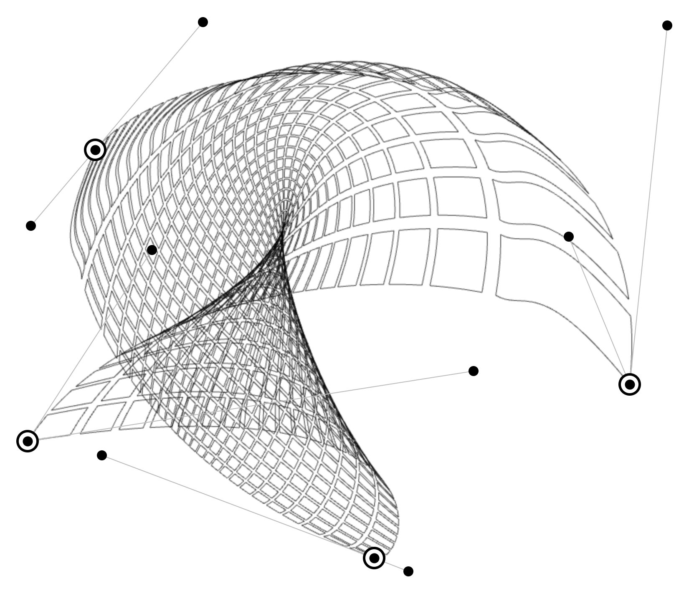

# README



This is an editor / demo for [warp-grid](https://github.com/undistraction/warp-grid).

You can use it [here](https://warp-grid-editor.undistraction.com).

Projects can be saved-to and loade-from your browser's local storage.

You can export config for `warp-grid` or export the grid as an SVG.

## Maintenance

### Install

```
pnpm install
```

### Run in development

```
pnpm run dev
```

### Build package

```
pnpm run build
```

### Preview build

```
pnpm run preview
```

### Lint

```
pnpm run lint-prettier
pnpm run lint-eslint
```

### Run tests

#### Unit tests (Vitest)

```
pnpm run test
```

#### E2E (Playwright)

Run the tests in the command-line

```
pnpm run test-e2e
```

Run the tests with a GUI

```
pnpm run test-e2e-ui
```
